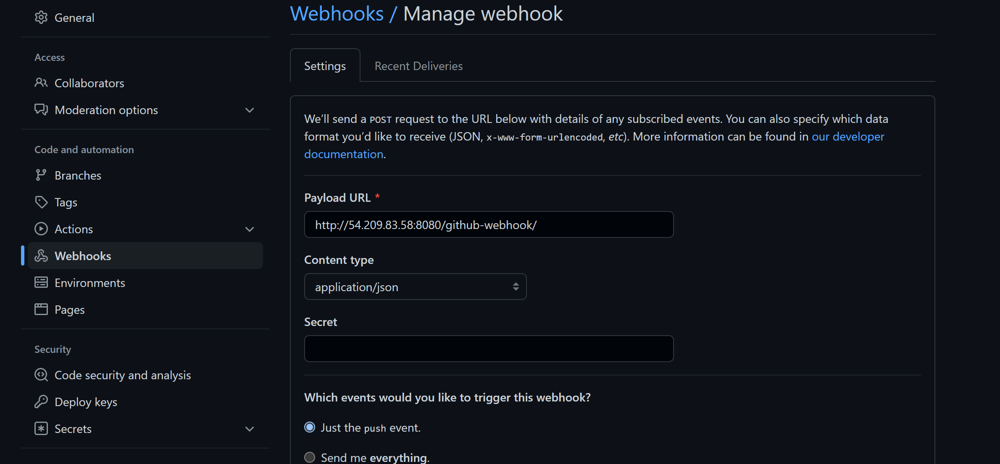

# Configure Jenkins Instance

Create an AWS EC2 server based on Ubuntu Server 20.04 LTS and name it "Jenkins-Ansible"

Install JDK (since Jenkins is a Java-based application)

```bash
sudo apt update -y
sudo apt install default-jdk-headless -y
```


Install Jenkins

```bash
wget -q -O - https://pkg.jenkins.io/debian-stable/jenkins.io.key | sudo apt-key add -
sudo sh -c 'echo deb https://pkg.jenkins.io/debian-stable binary/ > \
    /etc/apt/sources.list.d/jenkins.list'

sudo apt update
sudo apt install jenkins -y
```


Make sure Jenkins is up and running

```bash
systemctl status jenkins
```


By default Jenkins server uses TCP port 8080 – open it by creating a new Inbound Rule in your EC2 Security Group


## Perform initial Jenkins setup.

From your browser access 
*( http:Jenkins-Server-Public-IP-Address-or-Public-DNS-Name:8080 )*

You are prompted to provide a default admin password


Enter the following line of code to retrieve it from your server

```sudo
sudo cat /var/lib/jenkins/secrets/initialAdminPassword
```


Install the suggested plugins and create a username and password for login authentication, finally click on ```save and finish```


In your GitHub account, create a new repository and name it *```ansible-config-mgt```*.


Install Ansible

```bash
sudo apt update -y
sudo apt install ansible -y
```


Check your Ansible version by running 

```bash
ansible --version
```


Configure Jenkins build job to save your repository content every time you change it.

Create a new Freestyle project *```ansible```* in Jenkins and point it to your *```‘ansible-config-mgt’```* repository.
> On the dashboard, click on Create a job, enter the job name *```Ansible```*and click on *```Freestyle project```* and click Ok


Copy the url for the *```ansible-config-mgt```* repo


Under *```Source Code Management```*, click on *```Git```*, paste the repo url in the ```Repository URL``` field , under *```credentials```* , click *```Add```* - enter your Github login details


Click on ```Build Triggers``` and select ```GitHub hook trigger for GITScm polling``` to Configure triggering the job from GitHub webhook


Configure ```"Post-build Actions"``` to archive all the files – files resulted from a build are called "artifacts". Click on ```Add post-build action``` and select ```Archive the artifacts```. In the ```Files to archive?``` input ```**``` to archive mulitiple nested artifacts and click on save.


Configure ```ansible-config-mgt``` repo to use webhooks.

In the ```ansible-config-mgt``` repo, click on ```Settings > Webhooks > Add Webhooks```. Enter the Payload URL ```( Jenkins ip/github-webhook/)```, Content type ```apllication/json``` and click ```Add webhook```


Test setup by making some change in README.MD file in master branch and commit changes.


Make sure that builds starts automatically and Jenkins saves the files (build artifacts) in following folder

```bash
ls /var/lib/jenkins/jobs/Ansible/builds/4/archive/
```


Clone down your ansible-config-mgt repo to your Jenkins-Ansible instance

```bash
git clone https://github.com/oayanda/ansible-config-mgt.git
```


## BEGIN ANSIBLE DEVELOPMENT

create a new branch that will be used for development


Create two directories and name them ```playbooks``` and ```inventory``` respectively


Within the ```playbooks``` folder, create your first playbook, and name it ```common.yml```.
Within the ```inventory``` folder, create an inventory file (.yml) for each environment (Development, Staging Testing and Production) ```dev```, ```staging```, ```uat```, and ```prod``` respectively.


## Set up an Ansible Inventory

 > Ansible uses TCP port 22 by default, which means it needs to ssh into target servers from Jenkins-Ansible host – for this let's implement the concept of ssh-agent.

Install and start OpenSSH for windows. Run windows terminal in ```administrator``` mode.

```bash
 # Install the OpenSSH Client
 
Add-WindowsCapability -Online -Name OpenSSH.Client~~~~0.0.1.0

# Verify installation
Get-WindowsCapability -Online | Where-Object Name -like 'OpenSSH*'

# Start the sshd service
Start-Service sshd

# OPTIONAL but recommended:
Set-Service -Name sshd -StartupType 'Automatic'

# Confirm the Firewall rule is configured. It should be created automatically by setup. Run the following to verify
if (!(Get-NetFirewallRule -Name "OpenSSH-Server-In-TCP" -ErrorAction SilentlyContinue | Select-Object Name, Enabled)) {
    Write-Output "Firewall Rule 'OpenSSH-Server-In-TCP' does not exist, creating it..."
    New-NetFirewallRule -Name 'OpenSSH-Server-In-TCP' -DisplayName 'OpenSSH Server (sshd)' -Enabled True -Direction Inbound -Protocol TCP -Action Allow -LocalPort 22
} else {
    Write-Output "Firewall rule 'OpenSSH-Server-In-TCP' has been created and exists."
}
```


Add ```ssh-Agent```

```bash
# By default the ssh-agent service is disabled. Configure it to start automatically.
# Make sure you're running as an Administrator.
Get-Service ssh-agent | Set-Service -StartupType Automatic

# Start the service
Start-Service ssh-agent

# This should return a status of Running
Get-Service ssh-agent
```


Now load your private key file into ssh-agent and log into the Jenkins-Ansible instance using the defualt username ```ubuntu``` and the ```public-dns or public-ip```

```bash
ssh-add bammy-ec2.pem
 ssh -A ubuntu@ec2-3-86-45-0.compute-1.amazonaws.com
```


Update your inventory/dev.yml file with this snippet of code

```bash
[nfs]
<NFS-Server-Private-IP-Address> ansible_ssh_user='ec2-user'

[webservers]
<Web-Server1-Private-IP-Address> ansible_ssh_user='ec2-user'
<Web-Server2-Private-IP-Address> ansible_ssh_user='ec2-user'

[db]
<Database-Private-IP-Address> ansible_ssh_user='ec2-user' 

[lb]
<Load-Balancer-Private-IP-Address> ansible_ssh_user='ubuntu'
```

CREATE A COMMON PLAYBOOK    